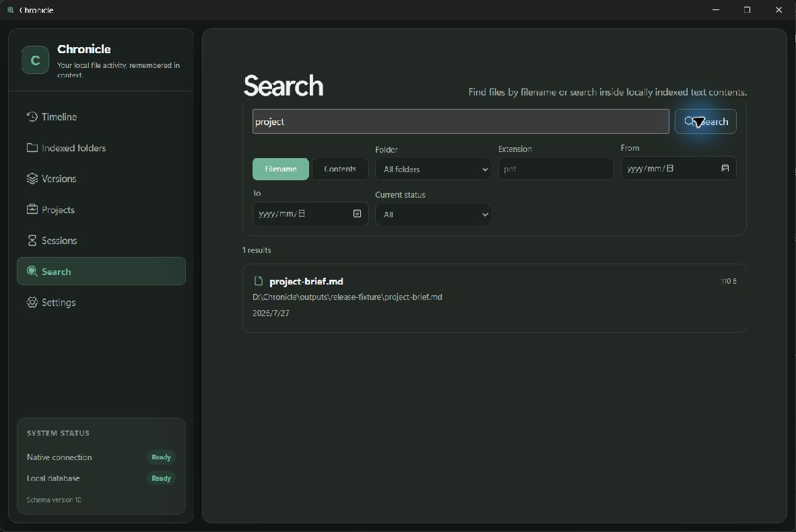

# Chronicle

Chronicle is a privacy-first Windows desktop application for rediscovering local files through time and context. It is a real Tauri application, not a website, cloud drive, employee-monitoring tool, analytics dashboard, or AI chat wrapper.

## v2.0.0

Chronicle v2.0.0 is the first public-release-quality build. This milestone turns the tested product into a verifiable release: aligned versions, gated tag publishing, validated Windows artifacts, honest limitations, accessibility fixes, privacy/security evidence, and a repeatable smoke-test path.

Included:

- Tauri 2, React, strict TypeScript, Rust, and bundled SQLite;
- explicit folder authorization and cancellable atomic metadata scans;
- database-backed Timeline, filtering, keyset pagination, details, and histories;
- explicitly enabled filesystem monitoring with coalescing and storm protection;
- opt-in local text content indexing with size and exclusion limits;
- user-reviewable version families, projects, and activity sessions;
- sanitized diagnostics with counts and status only;
- English and Simplified Chinese interfaces;
- migration, safety, UI, and reproducible scale tests;
- validated Windows NSIS packaging and gated GitHub Releases.

Chronicle does not read file contents unless content indexing is explicitly enabled for a folder, use AI, monitor hidden folders, upload data, or perform destructive operations against original files. Watcher history is best-effort and is not a perfect audit log.

## Download

Prebuilt Windows installers are published on the [Releases](https://github.com/Jelly-RayTian/Chronicle/releases) page from matching version tags. Windows installers are currently unsigned; verify the published SHA-256 digest and expect an unknown-publisher warning.

## Screenshots

These images are captured from the real Windows application using an isolated Chronicle profile and a temporary user-authorized fixture folder.

|                     Timeline                      |                     Indexed folders                     |
| :-----------------------------------------------: | :-----------------------------------------------------: |
|  |  |

|                    Search                     |                     Settings                      |
| :-------------------------------------------: | :-----------------------------------------------: |
|  |  |

## Privacy guarantees

- No analytics, telemetry, cloud storage, or metadata upload.
- Scanning is limited to folders the user explicitly selects.
- Monitoring is disabled by default and enabled per folder only.
- Metadata scanning never opens file contents and skips symbolic links.
- Content indexing is disabled by default and bounded by extension, size, and exclusions.
- Failed, cancelled, or interrupted scans preserve the last complete snapshot.
- Removing an index or uninstalling Chronicle never deletes original files.
- Diagnostics contain no file paths, names, or contents.

See [Privacy](docs/privacy.md), [Security](SECURITY.md), and the [v2.0.0 audit](docs/privacy-security-audit.md).

## Prerequisites

- Windows 11 x64 with WebView2 Runtime
- Node.js 24 and npm 11
- Rust stable 1.96 or newer with `x86_64-pc-windows-msvc`
- Visual Studio 2022 Build Tools with Desktop development with C++ and a Windows SDK

## Development

```powershell
npm install
npm run tauri dev
```

Required frontend checks:

```powershell
npm run format:check
npm run lint
npm run typecheck
npm test
npm run build
```

Required Rust checks:

```powershell
cargo fmt --manifest-path src-tauri/Cargo.toml --check
cargo clippy --manifest-path src-tauri/Cargo.toml --all-targets -- -D warnings
cargo test --manifest-path src-tauri/Cargo.toml
cargo check --manifest-path src-tauri/Cargo.toml
```

Build and validate the Windows installer:

```powershell
npm run tauri build
./scripts/validate-windows-artifacts.ps1
```

## Architecture

React renders the interface and calls one typed client. Thin Tauri commands delegate to Rust services. Rust owns SQLite, migrations, filesystem boundaries, scanning, watching, and platform actions. React components contain no SQL or filesystem logic.

Read [Architecture](docs/architecture.md) and [Database](docs/database.md).

## Documentation

- [Product](docs/product.md)
- [Architecture](docs/architecture.md)
- [Database](docs/database.md)
- [Event model](docs/event-model.md)
- [Privacy](docs/privacy.md)
- [Security](SECURITY.md)
- [Known limitations](docs/known-limitations.md)
- [Roadmap](docs/roadmap.md)
- [Testing](docs/testing.md)
- [Performance benchmarks](docs/benchmarks.md)
- [Release process](docs/releasing.md)
- [Smoke-test checklist](docs/smoke-test-checklist.md)
- [v2.0.0 smoke-test results](docs/smoke-test-results-v2.0.0.md)
- [Accessibility review](docs/accessibility.md)
- [Privacy and security audit](docs/privacy-security-audit.md)
- [Portfolio overview](docs/portfolio.md)
- [v2.0.0 release notes](docs/release-notes-v2.0.0.md)

## Project status

Chronicle is prepared at v2.0.0. The database and Timeline remain empty until the user authorizes a folder and completes a scan or enables monitoring; production components never create fake data.
