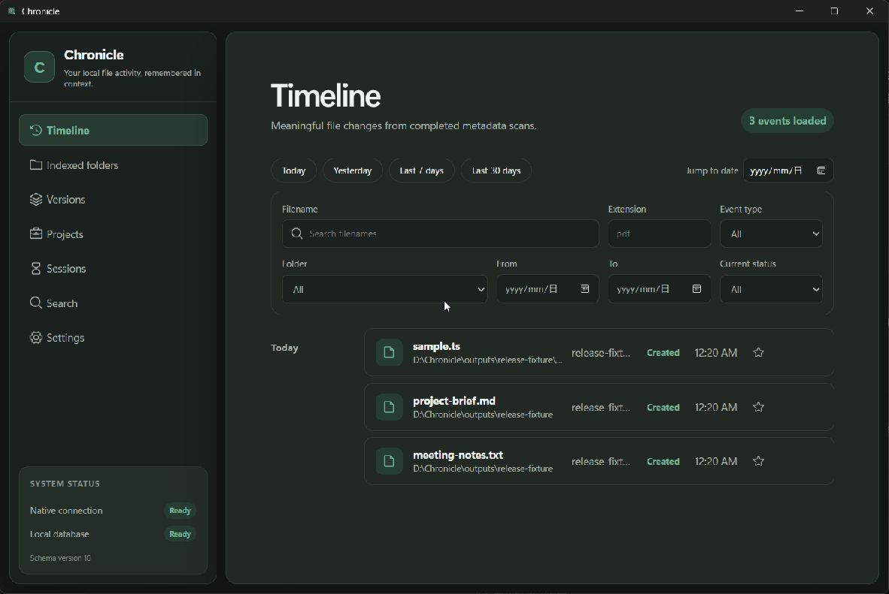
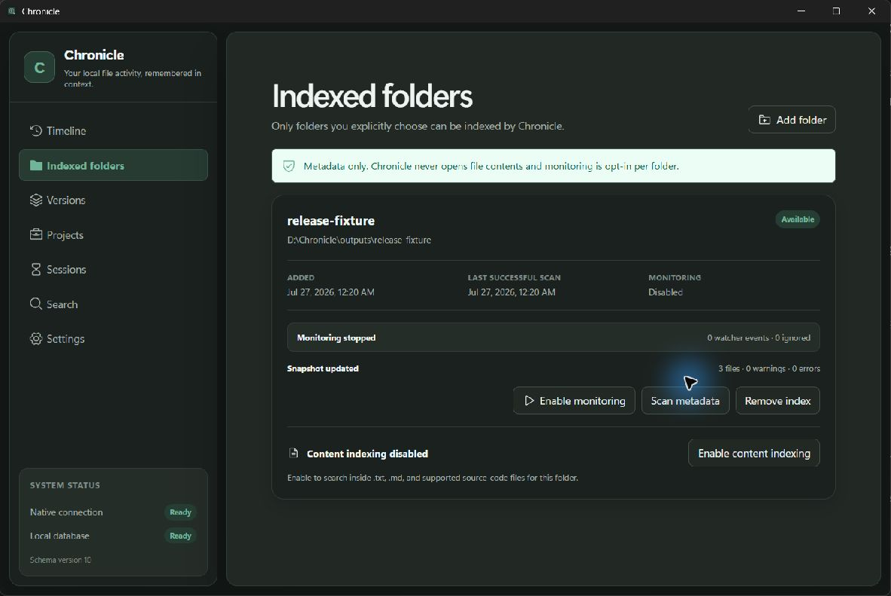
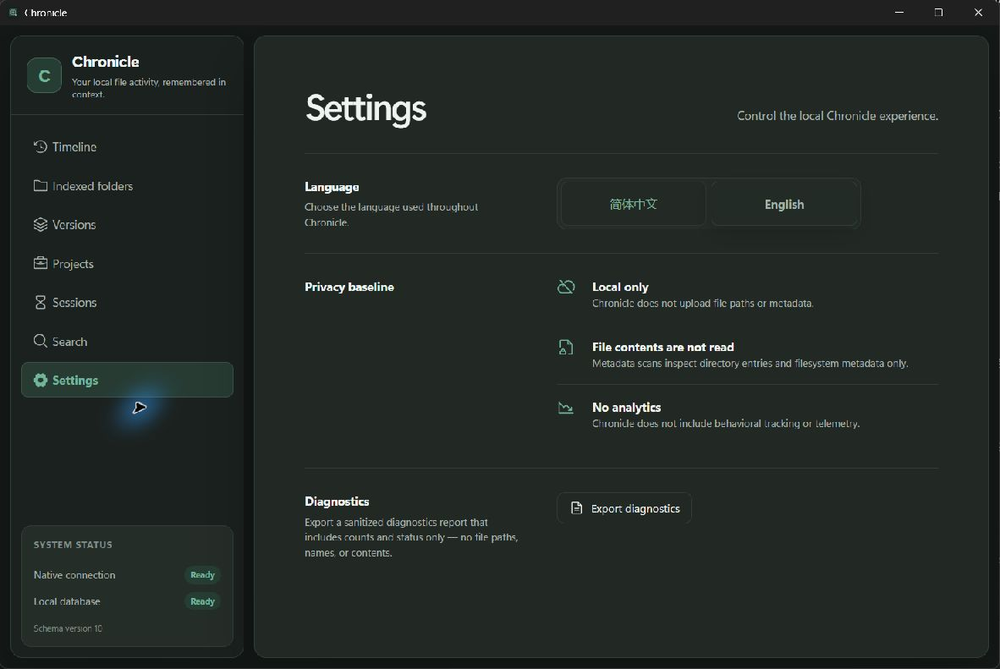

# Chronicle

Chronicle is a privacy-first desktop application for rediscovering local files through time and context. It is being built as a real Tauri application, not a website, cloud drive, employee-monitoring tool, analytics dashboard, or AI chat wrapper.

## v1.0.0-rc.1

Chronicle is approaching its first release candidate. It is a local, privacy-first file activity index built as a real Tauri desktop application—not a website, cloud drive, employee-monitoring tool, analytics dashboard, or AI chat wrapper.

What is included in this release candidate:

- a Tauri 2 desktop shell with React and strict TypeScript;
- a Rust service core behind typed Tauri commands;
- a local SQLite database with versioned migrations and upgrade tests;
- a database-backed Timeline with grouping, search, filters, pagination, details, and histories;
- native folder selection, persistent indexed roots, availability states, and explicit index removal;
- cancellable, batched Rust metadata scans with atomic created, modified, deleted, and unchanged reconciliation;
- explicitly enabled native filesystem monitoring with debounce, metadata recheck, event coalescing, and status/error controls;
- manual and startup reconciliation scans for missed watcher events;
- opt-in local content indexing for `.txt`, `.md`, and supported source-code files, with filename and content search;
- suggested and user-editable version families;
- suggested and user-editable projects with manual membership;
- activity sessions inferred from file events;
- a sanitized diagnostics export that includes counts and status only—no paths, names, or contents;
- Simplified Chinese and English interfaces;
- automated frontend and Rust tests, including migration upgrade and performance checks;
- Windows installer packaging and a GitHub Actions release workflow.

Chronicle does **not** read file contents unless content indexing is explicitly enabled for a folder, hash files, use AI, monitor hidden folders, upload data, or perform destructive file operations against original files. Watcher history is best-effort and not a perfect audit log.

## Download

Prebuilt Windows installers are available on the [Releases](https://github.com/Jelly-RayTian/Chronicle/releases) page. The latest release is `v1.2.0`.

## Screenshots

> Screenshots will be added to the release assets. Placeholder sections below show the intended views.

|                     Timeline                      |                     Indexed folders                     |                     Settings                      |
| :-----------------------------------------------: | :-----------------------------------------------------: | :-----------------------------------------------: |
|  |  |  |

## Privacy guarantees

- Chronicle has no analytics or telemetry.
- Chronicle has no cloud storage and does not upload paths or metadata.
- Scanning is limited to folders the user explicitly selects.
- Monitoring is disabled by default and can only be enabled per indexed folder.
- Metadata scanning never opens file contents and skips symbolic links by default.
- Content indexing is disabled by default and is opt-in per folder with extension, size, and exclusion controls.
- Watcher batches recheck metadata only and validate raw events against authorized roots.
- Failed, cancelled, or interrupted scans preserve the last complete snapshot.
- Clearing Chronicle data or removing an indexed folder will never delete original files.
- Diagnostics exports contain counts and status only; no file paths, names, or contents are included.

See [Privacy](docs/privacy.md) and [Security](SECURITY.md).

## Prerequisites

- Windows 11 with WebView2 Runtime
- Node.js 24 and npm 11
- Rust stable 1.96 or newer with the `x86_64-pc-windows-msvc` target
- Visual Studio 2022 Build Tools with Desktop development with C++ and a Windows SDK

## Development

```powershell
npm install
npm run tauri dev
```

Frontend checks:

```powershell
npm run format:check
npm run lint
npm run typecheck
npm test
npm run build
```

Rust checks:

```powershell
cargo fmt --manifest-path src-tauri/Cargo.toml --check
cargo clippy --manifest-path src-tauri/Cargo.toml --all-targets -- -D warnings
cargo test --manifest-path src-tauri/Cargo.toml
cargo check --manifest-path src-tauri/Cargo.toml
```

Build the Windows installer:

```powershell
npm run tauri build
```

## Architecture at a glance

React renders the interface and calls one typed client. Tauri commands validate the boundary and delegate to Rust services. Rust owns SQLite, migrations, platform contracts, task contracts, and filesystem watching. React components never contain SQL or filesystem logic.

Read [Architecture](docs/architecture.md) and [Database](docs/database.md) for details.

## Documentation

- [Product](docs/product.md)
- [Architecture](docs/architecture.md)
- [Database](docs/database.md)
- [Event model](docs/event-model.md)
- [Privacy](docs/privacy.md)
- [Platform limitations](docs/platform-limitations.md)
- [Known limitations](docs/known-limitations.md)
- [Roadmap](docs/roadmap.md)
- [Testing](docs/testing.md)

## Project status

Chronicle is at v1.2.0. The database and timeline are intentionally empty until the user authorizes a folder and completes a scan or explicitly enables monitoring; no fake production data is created.
